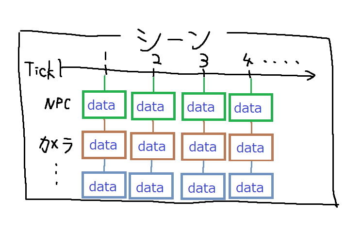
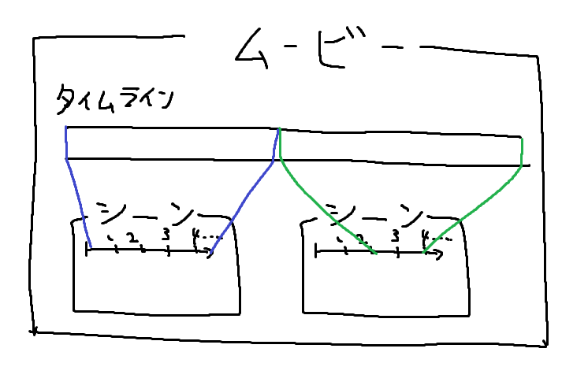

## Cinema4C

映像録画 & 再生プラグイン

```yaml
depend: WorldEdit
```

[Wiki](https://github.com/Be4rJP/Cinema4C/wiki)

### 動作確認済み環境
```
Spigot: 1.15.x, 1.16.x
```

### 概要

* 録画データの説明

録画するときは一つのシーンとして記録されます。

シーンの録画データは録画を始めるとNPCやカメラ等のデータとして、プレイヤーの状態を記録開始からのtick数と結び付けて記録していきます。



実際の録画データの例です
```yaml
version: 1
track-data:
  data0:
    type: NPC
    name: _Be4_
    skin:
      value: ewogICJ0aW1lc3RhbXAiIDogMTYyMDA0NjAzMjIyNywKICAicHJvZmlsZUlkIiA6ICI3Zjc0N2NjZWM3N2U0N2Q2YjlhNWViNGQ2NmM2MjViYSIsCiAgInByb2ZpbGVOYW1lIiA6ICJfQmU0XyIsCiAgInNpZ25hdHVyZVJlcXVpcmVkIiA6IHRydWUsCiAgInRleHR1cmVzIiA6IHsKICAgICJTS0lOIiA6IHsKICAgICAgInVybCIgOiAiaHR0cDovL3RleHR1cmVzLm1pbmVjcmFmdC5uZXQvdGV4dHVyZS9lZTRkOTk4MjU0ZDNmZTI1OTY3MjViYTI0MDJkN2E3ZmY2OGFhM2Y3ZjIwMmEwZGQ2NDcyMzE2ZWM4ZDIzZjE1IiwKICAgICAgIm1ldGFkYXRhIiA6IHsKICAgICAgICAibW9kZWwiIDogInNsaW0iCiAgICAgIH0KICAgIH0KICB9Cn0=
      signature: r/nJRC1mscvx7J5ofS41oHri3/kSsZZadKhaf+Ffsf3jO4FaJ5hDudsTlzSvWG1/xiVHmDHnVzTUKbrLXvnK8ACwnFXxwdGozTJPRIANpWSf5llAYa1pVkpdry+mG4X/xPsR6TZvx2/GatPhqU7vYMZ2aX0EPdKGr4u9NaCYiZzUHVCiR0oFDmIOYijNkTQB1L6n39sZBDQ+x50fOD9dPjmFxTyoAzbpgq7zDRQMYOO/t98V99ZhrauRP/otwCntqj0ni1LgolQRrmjS6j1zAO11eh1AHh19X+KnMj8CVbqG103HpF3CXGqcwO1AvBFBUmBB1j1cFkhQNYtWmHYuq1g7qY9AlR2tyuiNGUCw1bdkIpqWHXzSSJHklSR9qveVbzeJ7UfovZhs2X02PLRqG45bpJxrVL2MjT1S8Vrv28rQTkvmrFI9TNby/wCHx7BIPRgEXWrGjCPTcpAqD6IkO9wecK4Ca73UeU/smRhtaLmISXdfj4TR6E0TohXvV+y/GWCxqaJOcxsHlPnfI8vSoa16g/dBmtLqMLcDHArtUoa6YNQ4m1UQeuYga70X/gBbOO4PBc25inwk0Hg3NYGvK350jK8s7DoKENdg5IUL5ei9mBo9QWCJJXj+R9P2nSLp8VmXRfHoJPd4abeEcD2JngU7PoNAEkvwQ6pfX/g2QjQ=
    location:
      - '[0] 0.4611622776347275, 1.0, 0.27988840693252826, 142.27295, -5.7081714'
      - '[1] 0.4611622776347275, 1.0, 0.27988840693252826, 142.17236, -5.7081714'
      - '[2] 0.4611622776347275, 1.0, 0.27988840693252826, 142.17236, -5.7081714'
      - '[3] 0.4611622776347275, 1.0, 0.27988840693252826, 142.17236, -5.7081714'
      - '[4] 0.3942612784049331, 1.0, 0.19419512996925548, 142.02148, -5.5566'
    sneak: 0, 1, 2, 3
    swing: 2, 3
```

```yaml
version: 1
```
バージョンです。　バージョンがプラグイン側と合致しない場合は読み込めません。

```yaml
type: NPC
```
データのタイプです。NPCのほかにもCAMERAと、チャットメッセージとタイトルデータのMESSAGEがあります。

```yaml
name: _Be4_
```
実際にプレイヤーに見せるNPCの名前です(16文字以内)

```yaml
skin:
  value: ewogICJ0aW1lc3RhbXAiIDogMTYyMDA0NjAzMjIyNywKICAicHJvZmlsZUlkIiA6ICI3Zjc0N2NjZWM3N2U0N2Q2YjlhNWViNGQ2NmM2MjViYSIsCiAgInByb2ZpbGVOYW1lIiA6ICJfQmU0XyIsCiAgInNpZ25hdHVyZVJlcXVpcmVkIiA6IHRydWUsCiAgInRleHR1cmVzIiA6IHsKICAgICJTS0lOIiA6IHsKICAgICAgInVybCIgOiAiaHR0cDovL3RleHR1cmVzLm1pbmVjcmFmdC5uZXQvdGV4dHVyZS9lZTRkOTk4MjU0ZDNmZTI1OTY3MjViYTI0MDJkN2E3ZmY2OGFhM2Y3ZjIwMmEwZGQ2NDcyMzE2ZWM4ZDIzZjE1IiwKICAgICAgIm1ldGFkYXRhIiA6IHsKICAgICAgICAibW9kZWwiIDogInNsaW0iCiAgICAgIH0KICAgIH0KICB9Cn0=
  signature: r/nJRC1mscvx7J5ofS41oHri3/kSsZZadKhaf+Ffsf3jO4FaJ5hDudsTlzSvWG1/xiVHmDHnVzTUKbrLXvnK8ACwnFXxwdGozTJPRIANpWSf5llAYa1pVkpdry+mG4X/xPsR6TZvx2/GatPhqU7vYMZ2aX0EPdKGr4u9NaCYiZzUHVCiR0oFDmIOYijNkTQB1L6n39sZBDQ+x50fOD9dPjmFxTyoAzbpgq7zDRQMYOO/t98V99ZhrauRP/otwCntqj0ni1LgolQRrmjS6j1zAO11eh1AHh19X+KnMj8CVbqG103HpF3CXGqcwO1AvBFBUmBB1j1cFkhQNYtWmHYuq1g7qY9AlR2tyuiNGUCw1bdkIpqWHXzSSJHklSR9qveVbzeJ7UfovZhs2X02PLRqG45bpJxrVL2MjT1S8Vrv28rQTkvmrFI9TNby/wCHx7BIPRgEXWrGjCPTcpAqD6IkO9wecK4Ca73UeU/smRhtaLmISXdfj4TR6E0TohXvV+y/GWCxqaJOcxsHlPnfI8vSoa16g/dBmtLqMLcDHArtUoa6YNQ4m1UQeuYga70X/gBbOO4PBc25inwk0Hg3NYGvK350jK8s7DoKENdg5IUL5ei9mBo9QWCJJXj+R9P2nSLp8VmXRfHoJPd4abeEcD2JngU7PoNAEkvwQ6pfX/g2QjQ=
```
NPCのスキンデータです。

```yaml
location:
  - '[0] 0.4611622776347275, 1.0, 0.27988840693252826, 142.27295, -5.7081714'
  - '[1] 0.4611622776347275, 1.0, 0.27988840693252826, 142.17236, -5.7081714'
  - '[2] 0.4611622776347275, 1.0, 0.27988840693252826, 142.17236, -5.7081714'
  - '[3] 0.4611622776347275, 1.0, 0.27988840693252826, 142.17236, -5.7081714'
  - '[4] 0.3942612784049331, 1.0, 0.19419512996925548, 142.02148, -5.5566'
```
locationのリストがtickと結び付けたプレイヤーの座標です。

```yaml
sneak: 0, 1, 2, 3
```
プレイヤーがスニークしたタイミングのtickリスト

```yaml
swing: 0, 1, 2, 3
```
プレイヤーが腕を振ったタイミングのtickリスト

※その他データ形式は初回起動時に保存されるsample-record.ymlを参照

* ムービーデータの説明

基本的にサーバー内で再生するのは、一つか複数の録画データをつなぎ合わせたムービーデータです

※現在ムービーデータを作成 & 編集する機能がないので基本的に手動で追加することになります



実際のムービーデータの例です
```yaml
version: 1
after-location: 'world, 0.0, 0.0, 0.0, 0.0, 0.0'
scenes:
  - 'record1, 0, 0, [world, 0.0, 0.0, 0.0]'
  - 'record2, 60, 150, [world, 0.0, 0.0, 0.0]'
```

```yaml
version: 1
```
バージョンです。　バージョンがプラグイン側と合致しない場合は読み込めません。

```yaml
after-location: 'world, 0.0, 0.0, 0.0, 0.0, 0.0'
```
再生終了後にプレイヤーをテレポートさせる場所です

```yaml
scenes:
  - 'record1, 0, 0, [world, 0.0, 0.0, 0.0]'
  - 'record2, 60, 150, [world, 0.0, 0.0, 0.0]'
```
ムービーのタイムラインのデータです。

一行目が「record1」という名前の録画データを最初から最後まで再生することを表しています。

二行目が「record2」という名前の録画データを60Tickから150Tickまで再生することを表しています。

それぞれの行で指定されている録画データを指定されている時間で順に再生します。また、[world, 0.0, 0.0, 0.0]の部分は
録画データを再生する基準座標を記述します。


* コマンドリスト
```
/c4c record create [name]
/c4c record remove [name]
/c4c record play [name]
/c4c record save [name]
/c4c recorder create [record-data]
/c4c recorder add [type] [player]
/c4c recorder start
/c4c recorder stop
/c4c movie play [movie-data]
```

### 実際に使用するときのコマンドの例

* 新しくシーン撮影を開始するとき

```
/c4c record create test
```
「test」という名前の録画データを作成

```
/c4c recorder create test
```
WorldEditでトラッキングする範囲を選択した後、前のコマンドで作成した「test」という名前の録画データからレコーダーを作成

```
/c4c recorder add NPC be4r_jp
```
プレイヤー「be4r_jp」をNPCのモーションアクターとしてレコーダーに追加

```
/c4c recorder start
```
レコードを開始

```
/c4c recorder stop
```
レコードを停止

```
/c4c record play test
```
「test」という名前の録画データを試しに再生する

```
/c4c record save test
```
「test」という名前の録画データをファイルに保存


### Maven
```xml
<repositories>
    <repository>
        <id>jitpack.io</id>
        <url>https://jitpack.io</url>
    </repository>
</repositories>
```

```xml
<dependency>
    <groupId>com.github.Be4rJP</groupId>
    <artifactId>Cinema4C</artifactId>
    <version>v1.0.3</version>
    <scope>provided</scope>
</dependency>
```